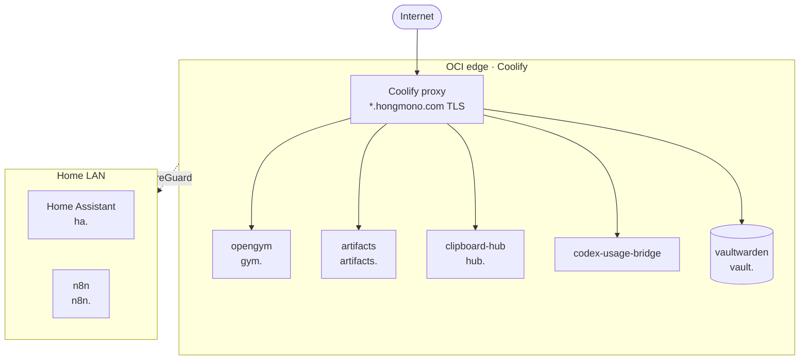

# omo-dori

정욱(@hongmono)의 개인 프로젝트, 개인 서버, 그리고 상시 비서 에이전트 **Dori**가 쓰는 저장소를 모아 둔 조직.

## 인프라 (2026-10)

- 앱 저장소에 push하면 GitHub 웹훅으로 Coolify가 자동 배포한다.
- `*.hongmono.com` 라우팅은 OCI 서버의 Coolify 프록시 설정에서 관리한다.

## 저장소

| 저장소 | 설명 | 배포 |
| --- | --- | --- |
| [opengym](https://github.com/omo-dori/opengym) | 운동 기록 앱 (AI 코치, 러닝 지도, Cloudflare D1) | Coolify · gym.hongmono.com |
| [artifacts](https://github.com/omo-dori/artifacts) | HTML·인터랙티브 문서를 링크로 공유하는 Bun 서버 | Coolify · artifacts.hongmono.com |
| [artifacts-content](https://github.com/omo-dori/artifacts-content) | artifacts에 올리는 페이지 원본 (업로드 API로 게시) | — |
| [clipboard-hub](https://github.com/omo-dori/clipboard-hub) | 개인 클립보드·Galaxy 릴레이 허브 | Coolify · tailnet |
| [codex-usage-bridge](https://github.com/omo-dori/codex-usage-bridge) | Codex·Claude Code 사용량을 Galaxy 위젯으로 | Coolify |
| [omo-dori-mode-experimental](https://github.com/omo-dori/omo-dori-mode-experimental) | Dori 모드: 메신저로 일을 받아 코딩 에이전트 세션을 띄우고 관리 (공개, 실험) | — |
| dori-memory | Dori 메모리 스냅샷 (비공개 백업) | — |

## Dori

텔레그램으로 요청을 받아 코딩 에이전트에게 일을 나눠 주고, 결과를 확인해서 보고하는 상시 비서 에이전트.
만든 문서와 페이지는 [artifacts.hongmono.com](https://artifacts.hongmono.com)으로 전달한다.
